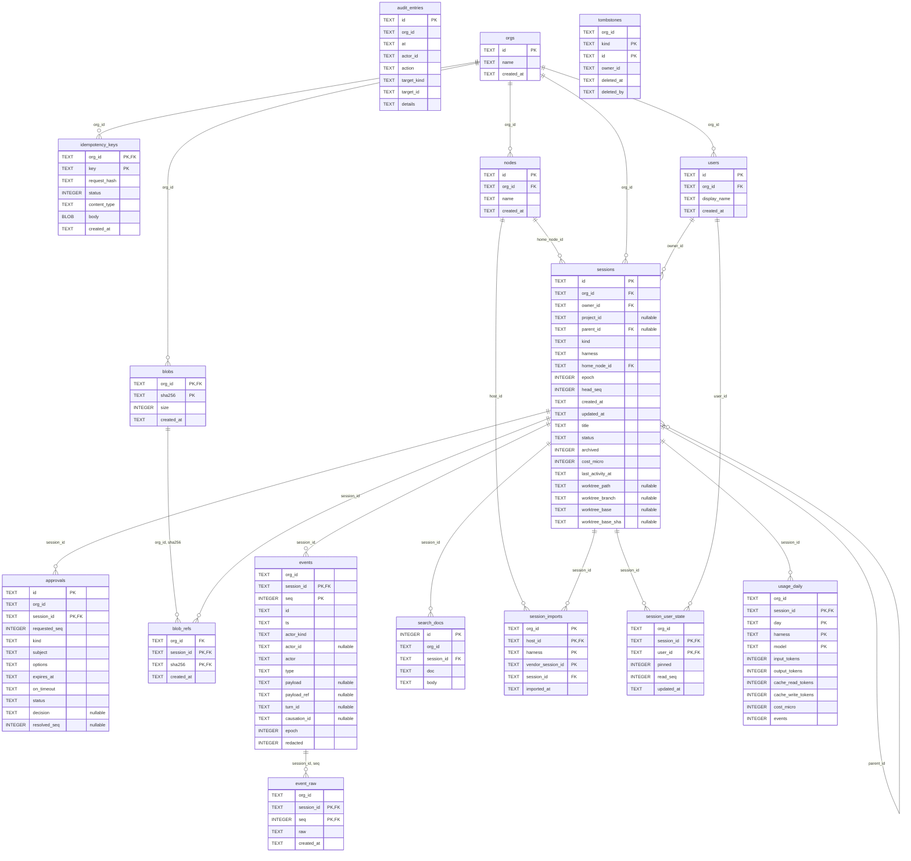

<!-- Generiert von `cargo xtask codegen` aus crates/beton-store/migrations/sqlite. Nicht von Hand ändern. -->

# Datenmodell (lokal, SQLite)

Schema-Version 6. Spezifikation: DATA-001 in [06-data-sync-protocol.md](../spec/06-data-sync-protocol.md#data-001--datenmodell--entitäten).

